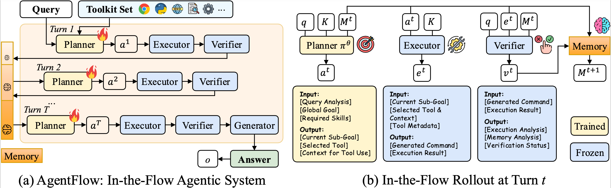
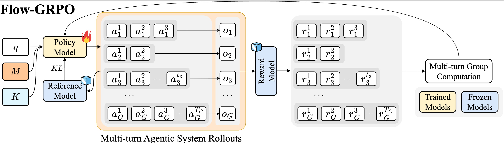
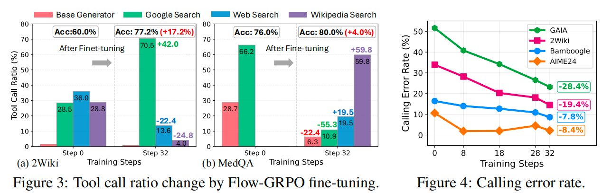

# AgentFlow 

<p align="center">
  <picture>
    <source media="(prefers-color-scheme: dark)" srcset="assets/imgs/logo.png">
    
  </picture>
</p>

<h3 align="center">
AgentFlow: In-The-Flow Agentic System Optimization for Effective Planning and Tool Use.
</h3>

<p align="center">
| 
<a href=""><b>Website</b></a> |
<a href=""><b>Paper</b></a> |
<a href="https://huggingface.co/agentflow"><b>Huggingface</b></a> |
<a href=""><b>Twitter</b></a> |
  <a href="https://deepwiki.com/lupantech/AgentFlow"><b>DeepWiki</b></a> |
  <a href=""><b>WeChat Group</b></a> |
  <a href=""><b>Slack</b></a>
|
</p>

AgentFlow is a trainable, tool-integrated agentic framework that addresses the scalability and generalization limitations of current tool-integrated reasoning approaches. 

Unlike prevailing methods, like Search-R1 that train a single LLM interleaving thoughts and tool calls, AgentFlow provides a modular agentic system with four specialized modules (planner, executor, verifier, generator) that coordinate through evolving memory and a toolkit over multiple turns to solve complex reasoning tasks.



For effective planning and tool use, the framework directly optimizes the planner agent within the system in an online fashion using Flow-based Group Refined Policy Optimization (Flow-GRPO), achieving superior performance across diverse domains with improved tool-calling reliability and long-horizon reasoning capabilities.



## Key Features
+ **Modular Agentic System**: Powerful Agentic System with four specialized modules (planner, executor, verifier, generator) augmented with tools that coordinate through evolving memory across multiple turns.
+ **Multi-Tool Integration**: Seamless integration with diverse tool ecosystems, including base_generator, python_coder, google_search, wikipedia_search, and web_search.
+ **Flow-GRPO Algorithm**: Novel Flow-based Group Refined Policy Optimization that enables in-the-flow optimization within agentic systems under long-horizon reasoning tasks with sparse reward.

## Experiments
### Main results
Through comprehensive experiments on ten benchmarks, AgentFlow with a 7B-scale backbone (Qwen-2.5-7B-Instruct) outperforms top-performing baselines with average accuracy gains of 14.9% on search, 14.0% on agentic, 14.5% on mathematical, and 4.1% on scientific tasks. Notably, our 7B-backbone system even surpasses the ∼200B-parameter GPT-4o. 


### In-depth analysis
Further analyses confirm the benefits of in-the-flow optimization,
demonstrating improved planning, enhanced tool-calling reliability, and positive
scaling trends with model size and reasoning turns. Please explore more findings at our paper or the project page.




## Setup
### Installation
```bash
bash setup.sh
source .venv/bin/activate
# (Optional) Install `parallel` for running benchmark experiments in parallel:
sudo apt-get update
sudo apt-get install parallel
```

### Setup Environment Variables
Duplicate the `.env.template` file and rename it to `.env`. Next, update the variables (`OPENAI_API_KEY`, `GOOGLE_API_KEY`, `GOOGLE_CX`, `DASHSCOPE_API_KEY`) with your own keys.  
```
cp .env_template .env
```

## Quick Start
### Dataset Preparation
```bash
# train data
python data/get_train_data.py
# validation data
python data/aime24_data.py
```

After that, data dir should be:
```
data/
├── train/
│   └── combined_train.parquet (182,190 samples)
├── val/
│   └── aime24.parquet (30 samples)
├── aime24_data.py
└── get_train_data.py
```
### AgentFlow Train
Start agentflow training with tmux:
```bash
# Create tmux session and start agentflow service (Window 0)
tmux new-session -s agentflow
bash train/serve_with_logs.sh

# Create new window (Ctrl+B then C) and start training (Window 1)
bash train/train_with_logs.sh
```
**Configuration:**
All training hyperparameters are in `train/config.yaml` (model settings, tools, RL parameters, resources, etc.)

### AgentFlow Inference
Serve the trained planner model with VLLM (here we deploy our 7B Flow-GRPO planner model):
```bash
bash scripts/serve_vllm.sh
```

Run inference on benchmark tasks:
```bash
cd test
bash exp/run_all_models_all_datasets.sh
```

## Core Contributors

<table>
<tr>
    <td align="center">
        <a href="https://zhuofeng-li.github.io/">
            
            <br />
            <sub><b>Zhuofeng Li</b></sub>
        </a>
    </td>
    <td align="center">
        <a href="https://github.com/IsaacGHX">
            
            <br />
            <sub><b>HaoXiang Zhang</b></sub>
        </a>
    </td>
    <td align="center">
        <a href="https://lupantech.github.io/">
            
            <br />
            <sub><b>Pan Lu</b></sub>
        </a>
    </td>
</tr>
</table>

## Acknowledgements

We thank the following open-source projects:
- [verl](https://github.com/volcengine/verl) for the excellent RL framework design.
- [VLLM](https://github.com/vllm-project/vllm) for fast LLM inference support.
- [agent-lightning](https://github.com/microsoft/agent-lightning) for early-stage exploration in agentic RL Training. 

We thank [Lambda](https://lambda.ai/careers) for GPU support!


